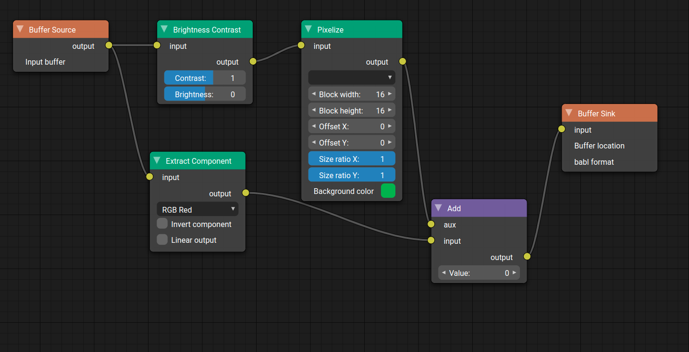

# Node Graph Editor

[Blender](https://www.blender.org) style node graph editor.

# Screenshot



# Example

```html
<!DOCTYPE html>
<html lang="en">
  <head>
    <meta charset="UTF-8" />
    <meta name="viewport" content="width=device-width, initial-scale=1.0" />
    <title>Demo</title>
    <link href="src/graph-editor/editor.css" rel="stylesheet">
    <link href="src/image-kit/image-kit.css" rel="stylesheet">
    <style>
      *, html, body {
        padding: 0;
        margin: 0;
      }
      #container {
        width: 100vw;
        height: 100vh;
      }
    </style>
  </head>
  <body>
    <div id="container">
    </div>
    <script src="node-graph-ui.umd.js"></script>
    <script>  
      const graphicalHelper = new nodeGraphUi.GeglGraphicalHelper();
      const nodeFactory = new nodeGraphUi.NodeFactory(nodeGraphUi.geglNodeDefinitions);
      
      let editor = new nodeGraphUi.GraphEditor({
        container: document.querySelector("#container"),
        graphicalHelper,
        nodeFactory
      });
      editor.registerSelector("select-color", new nodeGraphUi.ColorSelector());
      editor.onGraphChange(nodeGroup => {
        console.log("GRAPH CHANGE", nodeGroup);
      });

      const n0 = nodeFactory.createNode("gegl:png-load", new nodeGraphUi.Point(100, 100));
      const n1 = nodeFactory.createNode("gimp:colorize", new nodeGraphUi.Point(400, 100));
      const n2 = nodeFactory.createNode("gegl:png-save", new nodeGraphUi.Point(700, 100));
      n1.findProperty("color").value = { r: 128, g: 53, b: 96 };
      editor.setNodeGroup({
        nodes: [ n0, n1, n2 ]
      });

      const img = new Image();
      img.onload = () => {
        const canvas = document.createElement("canvas");
        const ctx = canvas.getContext("2d");
        canvas.width = img.width;
        canvas.height = img.height;
        ctx.drawImage(img, 0, 0, img.width, img.height);
        const imageData = ctx.getImageData(0, 0, img.width, img.height);
        const args = {};
        args[n0.id] = imageData;
        editor.updatePreviews(args);
      };
      img.src = "cat.png";
    </script>
  </body>
</html>
```

# Links

* [Laidout](https://laidout.org/) also implement (among many others features) a node graph editor.
